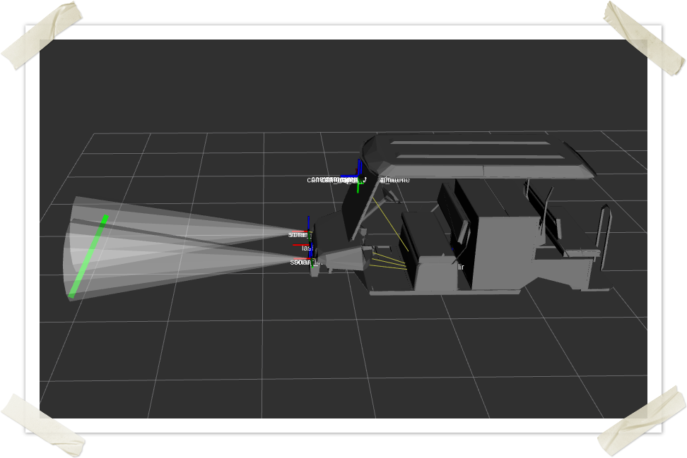

#Drive By wire

This Node will provide the Drive by wire control for the buggy

==Published CAN messages==

* [x] Throttle
* [x] Break
* [x] Acceleration

==Subscribed ROS topics==

* [x] /LSAD/joy
* [x] /LSAD/cmd_vel

This node will talk to the Curtis controller to move the buggy in a desired manner .

 